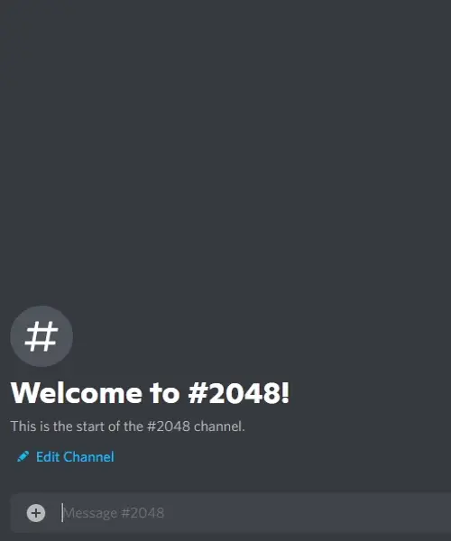

# discord-2048

This is a Discord bot that lets you play 2048.



# How to use it

[Add the bot to your server.](https://discord.com/api/oauth2/authorize?client_id=724500918887907349&scope=bot)

To start a game, mention the bot in a text channel and the bot will start a game in that channel.

Make sure the bot has permission to read messages, send messages, and add reactions in the channels that it is used.

# Running your own instance of the bot

To run your own instance of the bot:

1. [Create an application on Discord.](https://discord.com/developers/applications)
2. Go to the Bot page for your application and create a bot account.
3. Copy the bot's token.
4. Run the bot with `npm start <token>`, or set the environment variable `DISCORD_2048_BOT_TOKEN` and just run `npm start`.

Add the bot to your server by going to the following URL, replacing `<YOUR_CLIENT_ID_HERE>` with the client ID found on the OAuth2 page of the Discord application you created.

```
https://discord.com/api/oauth2/authorize?client_id=<YOUR_CLIENT_ID_HERE>&scope=bot
```

Make sure the bot has permission to read messages, send messages, and add reactions in the channels that it is used.
