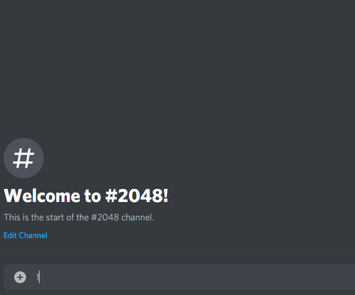

# discord-2048
This is a Discord bot that lets you play 2048.

# How to use it
[Add the bot to your server.](https://discord.com/oauth2/authorize?client_id=724500918887907349&scope=bot)

To play, send !2048 in a text channel and the bot will start a game in that channel.

# Running your own instance
You can run your own instance by [creating an application on Discord](https://discord.com/developers/applications). Set the environment variable `DISCORD_2048_BOT_TOKEN` to the bot token of the application.

Start the bot by running `node server.js`. You can also specify the bot token using the `--token` command line argument.

Add the bot to your server using the above URL, replacing the `client_id` value with the client ID of the Discord application you created.
